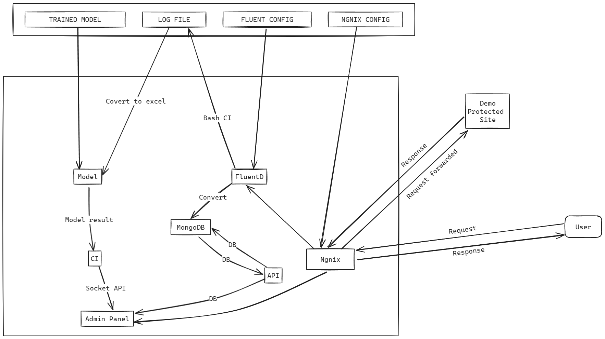

<h1 align="center">SEIM</h1> 

  [](https://choosealicense.com/licenses/mit/)


SEIM is a custom log monitoring and filtering solution that is built using Docker, It allows visualizing data from multiple sources and generate PDF reports to be shared. It is based on my research done on SIEM platforms like wazuh and Splunk. It can also connect to different AI models to detect threats in real time.

#### Note
This repository only contains the architecture and the analysis code for the platform, not the code related to AI model. The model and its functionality are exposed using an API endpoint. 
The best_model.pkl file is the model for the detection is not included in this git repo, but it can be download for this [Drive](https://drive.google.com/file/d/1eFBOXEAs12yjRCZgUEii3ris66njeQpt/view?usp=sharing)

## Model
The Model for the detection can be download [here](https://drive.google.com/file/d/1eFBOXEAs12yjRCZgUEii3ris66njeQpt/view?usp=sharing) and should be placed in the [guard](guard) directory

## Deployment

To deploy this project run

```bash
  bash setup.sh
```
OR

```sh
chmod +X setup.sh \
./setup.sh
```

## Usage/Examples

Visit [`localhost`](http://localhost) to view the demo site and visit [`admin.localhost`](http://admin.localhost) to get access to the admin panel after running the start-up script, to view live analytics and alerts about attacks happening on the demo site.

To Stop the project run the setup script with the stop argument `./setup.sh stop`

<h2 id="scenario1"> :small_blue_diamond: Docker Compose OverView</h2>


<h2 id="scenario1"> :small_blue_diamond: User Data Workflow</h2>


## Authors

- [@snowkluster](https://github.com/snowkluster)

